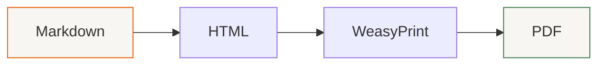
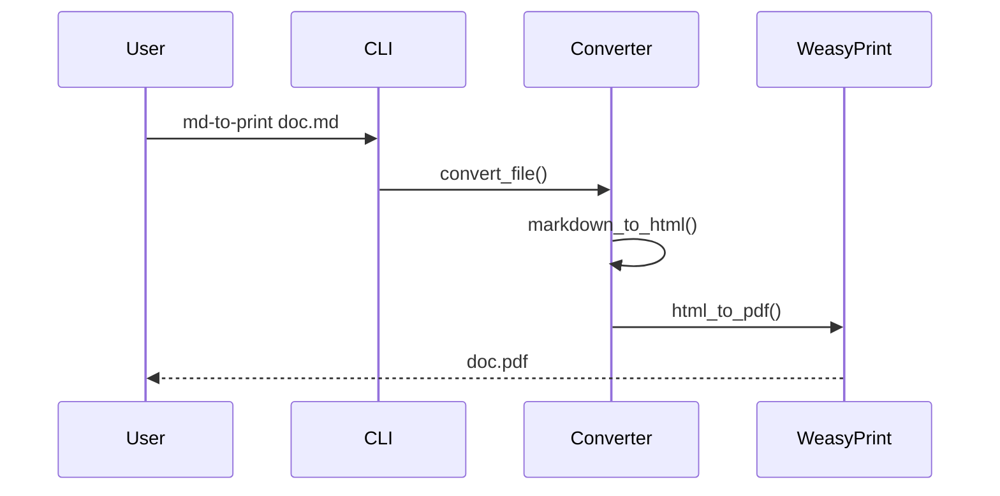

# Test Document for md-to-print

This is a test document to verify the markdown to PDF conversion works correctly.

## Features

The tool should handle:

- **Bold text** and *italic text*
- Lists with proper formatting
- Code blocks with syntax highlighting
- Tables (including large ones that flow across columns)
- Blockquotes

## Code Example

Here's a Python function:

```python
def greet(name: str) -> str:
    """Return a greeting message."""
    return f"Hello, {name}!"

if __name__ == "__main__":
    print(greet("World"))
```

## Small Table

| Feature | Status | Notes |
|---------|--------|-------|
| Two columns | Done | Using CSS columns |
| Page numbers | Done | In footer |
| Keep together | Done | For paragraphs, code |

## Large Table Test

This table should flow across columns/pages with headers repeating:

| ID | Name | Category | Status | Priority | Description |
|----|------|----------|--------|----------|-------------|
| 1 | Alpha Feature | Core | Active | High | Primary system component |
| 2 | Beta Module | Plugin | Pending | Medium | Extension framework |
| 3 | Gamma Service | API | Active | High | External interface |
| 4 | Delta Handler | Core | Deprecated | Low | Legacy support |
| 5 | Epsilon Worker | Background | Active | Medium | Async processing |
| 6 | Zeta Validator | Security | Active | Critical | Input validation |
| 7 | Eta Transformer | Data | Active | High | Format conversion |
| 8 | Theta Cache | Performance | Active | Medium | Memory optimization |
| 9 | Iota Logger | Monitoring | Active | Low | Debug output |
| 10 | Kappa Router | Network | Active | High | Request handling |
| 11 | Lambda Parser | Core | Active | High | Syntax analysis |
| 12 | Mu Serializer | Data | Active | Medium | Object encoding |
| 13 | Nu Compressor | Performance | Testing | Low | Size reduction |
| 14 | Xi Encryptor | Security | Active | Critical | Data protection |
| 15 | Omicron Queue | Background | Active | Medium | Job scheduling |
| 16 | Pi Calculator | Math | Active | Low | Numeric operations |
| 17 | Rho Renderer | UI | Active | High | Display output |
| 18 | Sigma Aggregator | Data | Active | Medium | Collection ops |
| 19 | Tau Timer | System | Active | Low | Scheduling |
| 20 | Upsilon Updater | Maintenance | Pending | Medium | Version control |

## Mermaid Diagram

Here's a flowchart rendered from Mermaid:



And a sequence diagram:



## Blockquote

> This is a blockquote. It should be styled nicely with a left border
> and some background color to set it apart from regular text.

## More Content

Lorem ipsum dolor sit amet, consectetur adipiscing elit. Sed do eiusmod tempor incididunt ut labore et dolore magna aliqua. Ut enim ad minim veniam, quis nostrud exercitation ullamco laboris.

Duis aute irure dolor in reprehenderit in voluptate velit esse cillum dolore eu fugiat nulla pariatur. Excepteur sint occaecat cupidatat non proident, sunt in culpa qui officia deserunt mollit anim id est laborum.

## Conclusion

This document tests all the major markdown features to ensure proper PDF output.
